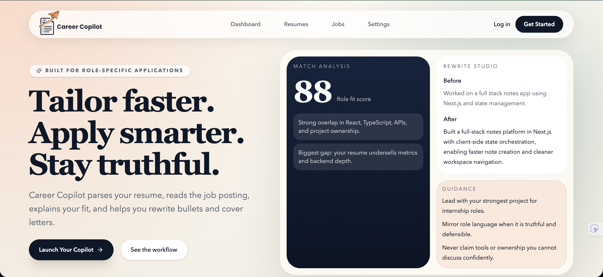
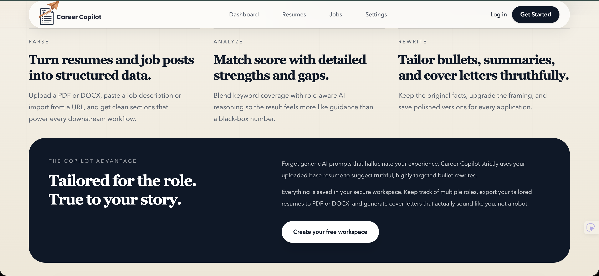
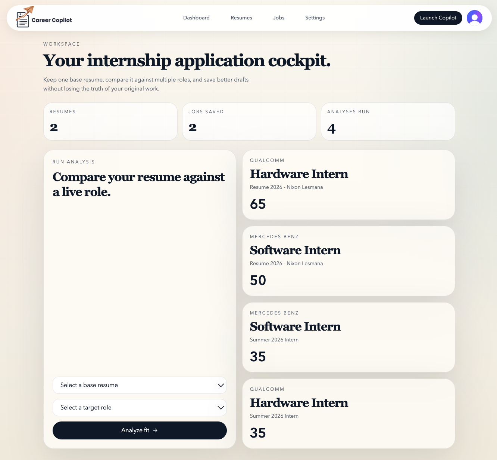
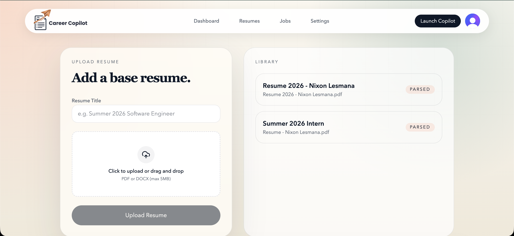
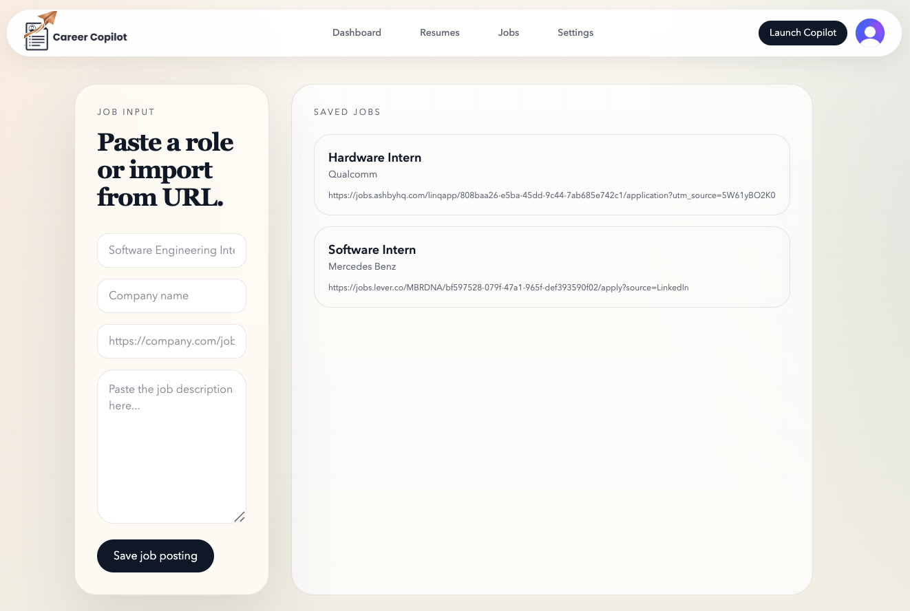
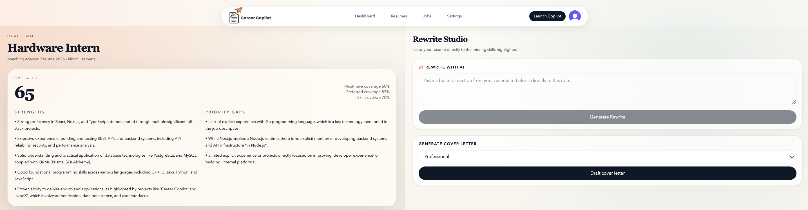

# Career Copilot


Career Copilot is an AI-powered resume tailoring platform built for students and new grads. It helps users compare their resume against a target job, identify fit gaps, and generate sharper, truthful application materials without fabricating experience.

---

## Live Demo

🔗 **Live App:** https://career-copilot-main.vercel.app

---

## Overview

Applying to internships and entry-level roles often means rewriting the same resume over and over again, usually with vague advice or generic AI output.

Career Copilot turns that process into a structured workflow:
- upload a base resume
- save a job posting
- analyze your fit
- rewrite bullets more effectively
- generate tailored cover letters
- keep everything grounded in your real experience

The product is designed around one principle: **better framing, not fake qualifications**.

---

## Features

### Resume Parsing
Upload a PDF or DOCX resume and turn it into structured, reusable data for future applications.

### Job Intake
Save target roles by pasting job descriptions or importing them from a URL.

### Match Analysis
Get a clearer picture of your fit through:
- overall match score
- role-specific strengths
- missing keywords
- experience gaps
- practical next steps

### Rewrite Studio
Generate stronger, more targeted resume bullets that align with the role without exaggerating your experience.

### Cover Letter Generation
Create concise, tailored cover letters based on your resume, job posting, and analysis context.

### Saved Workspace
Manage resumes, job postings, analyses, and generated materials from a single dashboard.

---

## Why I Built It

Most career tools are either too generic or push people toward exaggeration.

I built Career Copilot to create a more honest and useful workflow for job seekers, especially students and new grads who need help translating real experience into stronger applications without overstating what they have done.

---

## Screenshots
A quick look at Career Copilot’s core experience, from the public landing page to the logged-in application workflow.

### Landing Page


### Landing Page Detail


### Dashboard


### Resume Management


### Job Management


### Match Analysis


---

## Tech Stack
### Frontend
- Next.js
- React
- TypeScript
- Tailwind CSS
- Framer Motion

### Backend
- Next.js App Router
- Server Actions
- API Routes

### Database and Auth
- PostgreSQL via Supabase
- Prisma ORM
- Clerk Authentication

### AI
- Google Gemini
- AI SDK

### Deployment
- Vercel

---

## Architecture
Career Copilot is a full-stack Next.js application.

- The **frontend** handles the landing page, dashboard, and all user-facing workflows
- The **backend** lives inside the same Next.js app through Server Actions and API routes
- **Prisma** connects the app to Supabase Postgres
- **Clerk** manages authentication and user identity
- **Gemini** powers structured parsing, analysis, rewrites, and cover letter generation

---

## Project Structure

```md
CareerCopilot
├── prisma        # Database schema and migrations
├── public        # Images and static assets
├── screenshots   # Application screenshots used in README
├── src           # Frontend, backend routes, actions, and app logic
├── .gitignore
├── eslint.config.mjs
├── next.config.ts
├── package-lock.json
├── package.json
├── postcss.config.mjs
├── tsconfig.json
└── README.md
```
---

## Roadmap
- Better resume editing workflows
- Richer export options
- Subscription plans
- Smarter job import and cleanup
- Improved analytics and usage tracking
- More advanced feedback on resume-role alignment
- Repository Description
- AI-powered resume tailoring and job match analysis for students and new grads.

---

## Author
Nixon Lesmana

---

## License
Copyright © 2026 Nixon Lesmana. All rights reserved.
